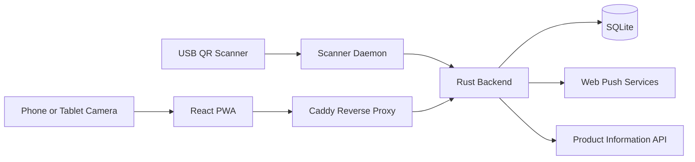
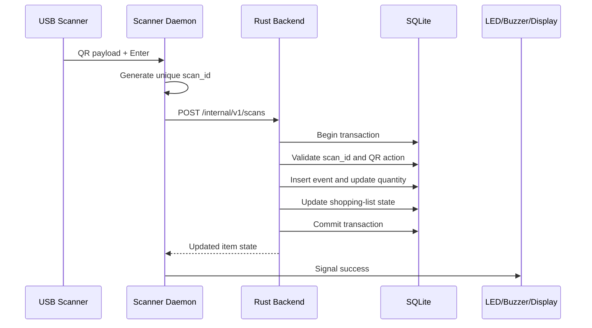
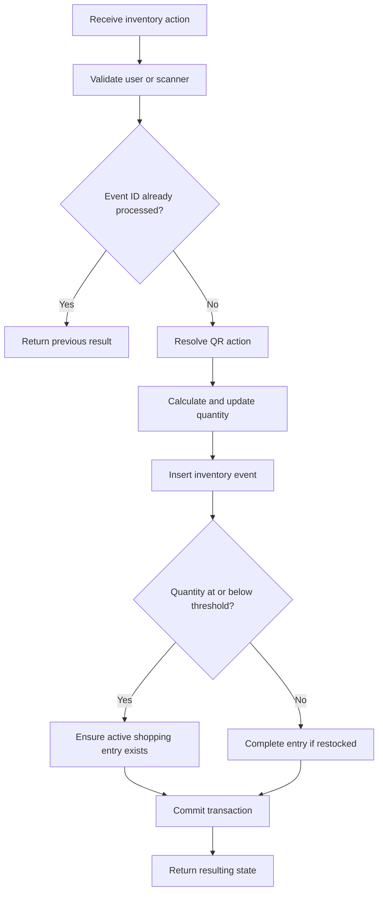

# System Architecture

## 1. Purpose

This document describes the high-level architecture of the household inventory system.

The application consists of three main software components:

1. A React Progressive Web App
2. A Rust backend
3. A Rust scanner daemon running on a Raspberry Pi

The dedicated QR scanner is the primary method for changing inventory quantities. The web application is primarily used to view and manage the inventory and shopping list. It also provides a camera-based scanner as a fallback.

---

## 2. Design Goals

The architecture should support the following goals:

* Inventory changes should require as little interaction as possible.
* A dedicated scanner should work without opening the web application.
* The same QR codes should work with both the dedicated scanner and the mobile fallback scanner.
* Multiple scans of the same QR code must produce multiple inventory changes.
* Retried requests must not accidentally apply the same scan twice.
* Every inventory change must be traceable and reversible.
* The frontend must not be trusted to enforce business rules.
* The system should be self-hostable on a Raspberry Pi.
* The system should continue to work locally if external services are unavailable.
* Authentication and public access must use HTTPS.

---

## 3. System Context



The dedicated scanner and scanner daemon communicate with the backend locally on the Raspberry Pi.

The React PWA communicates with the backend through the public HTTPS endpoint provided by Caddy.

---

## 4. Main Components

### 4.1 React PWA

The frontend is an installable Progressive Web App built with React, TypeScript, and Vite.

Its responsibilities include:

* displaying the current inventory
* displaying the shopping list
* managing inventory items
* configuring thresholds and units
* displaying inventory history
* undoing previous inventory events
* generating and previewing QR codes
* printing and sharing QR cards
* scanning QR codes and product barcodes using the device camera
* managing user sessions
* registering for push notifications

The frontend must not directly determine whether an item belongs on the shopping list. It sends commands to the backend and displays the state returned by the backend.

For example, the frontend may request:

```http
POST /api/v1/qr-actions/{token}/execute
```

The backend is responsible for:

* validating the action
* updating the quantity
* creating the inventory event
* updating the shopping list
* returning the resulting state

---

### 4.2 Rust Backend

The Rust backend is the central application component and the single source of truth.

A suitable framework is Axum.

Its responsibilities include:

* authentication
* session management
* authorization
* household membership
* inventory management
* shopping-list management
* QR action management
* barcode-to-inventory mappings
* inventory event processing
* undo operations
* push subscriptions
* notification delivery
* database access
* external product-data lookup

The backend should be structured into feature-oriented modules:

```text
backend/src/
├── auth/
├── users/
├── households/
├── inventory/
├── shopping/
├── qr/
├── scanner/
├── products/
├── notifications/
├── database/
├── config.rs
├── error.rs
├── routes.rs
├── state.rs
└── main.rs
```

A request should generally pass through these layers:

```text
HTTP request
    ↓
Router
    ↓
Handler
    ↓
Service
    ↓
Repository
    ↓
SQLite
```

#### Handler

The handler processes HTTP-specific concerns:

* route parameters
* JSON parsing
* authentication extraction
* status codes
* response serialization

#### Service

The service contains business rules:

* whether an inventory action is valid
* how thresholds affect the shopping list
* how undo works
* whether a user belongs to a household
* how product barcodes are mapped

#### Repository

The repository performs database operations.

It should not decide business rules. It should provide operations such as:

```text
find inventory item
insert inventory event
update item quantity
find active shopping-list entry
insert product mapping
```

---

### 4.3 Scanner Daemon

The scanner daemon is a separate Rust process running on the Raspberry Pi.

It is separate from the backend because hardware input is an infrastructure concern rather than part of the HTTP application.

Its responsibilities include:

* opening the scanner input device
* receiving decoded QR or barcode text
* detecting the end of each scan
* generating a unique scan ID
* sending the scan to the backend
* retrying failed requests
* preserving the scan ID during retries
* optionally controlling a buzzer, LED, or display

The scanner daemon does not update SQLite directly. All inventory changes must pass through the backend service layer.

This ensures that scanner changes and PWA changes follow the same rules.



---

### 4.4 SQLite Database

SQLite stores the persistent application state.

It contains:

* users
* authentication identities
* sessions
* households
* household members
* inventory items
* reusable QR actions
* processed scanner events
* immutable inventory events
* shopping-list entries
* product barcode mappings
* price history
* push subscriptions

SQLite is appropriate because:

* the system runs on one Raspberry Pi
* the expected number of concurrent writes is small
* deployment and backup are simple
* transactions provide atomic inventory changes

The database must be accessed only through the backend.

---

### 4.5 Caddy

Caddy acts as the public entry point.

It provides:

* HTTPS
* TLS certificate management
* static frontend hosting
* reverse proxying for the public API
* compression
* optional security headers

Example routing:

```text
https://inventory.example.com/
    → React production build

https://inventory.example.com/api/*
    → Rust backend at 127.0.0.1:3000
```

The scanner endpoint should not be publicly proxied:

```text
http://127.0.0.1:3000/internal/v1/scans
```

Only local processes on the Raspberry Pi should be able to call it.

---

## 5. QR-Code Architecture

Each inventory item normally has two reusable QR actions:

* increase the quantity
* decrease the quantity

A QR code contains a public URL:

```text
https://inventory.example.com/q/{random-action-token}
```

Example:

```text
https://inventory.example.com/q/K71F4HD8M29Q
```

The token is mapped to an action in the database:

```text
K71F4HD8M29Q
    → household 1
    → inventory item 42
    → quantity change -1
```

The URL format allows the same QR code to work with:

1. the dedicated USB scanner
2. the scanner inside the PWA
3. the built-in iPhone or iPad Camera application

### Dedicated scanner

The scanner outputs the entire URL as text. The scanner daemon extracts the token and submits it to the local backend.

### PWA scanner

The PWA decodes the URL but does not navigate to it. It extracts the token and directly calls the API.

### Built-in phone camera

The operating system opens the URL. The QR action page loads and automatically submits the inventory action after verifying the user session.

The public `GET` route must not directly change state:

```http
GET /q/{token}
```

It only serves the application page.

The inventory change requires a `POST` request:

```http
POST /api/v1/qr-actions/{token}/execute
```

This prevents link previews, preloading, and web crawlers from modifying the inventory.

---

## 6. Scan Identity and Idempotency

A QR action is reusable. A scan event is unique.

```text
QR action token
    identifies what should happen

Scan ID
    identifies one physical scan
```

Example:

```text
First scan:
    token = K71F4HD8M29Q
    scan_id = A

Second scan:
    token = K71F4HD8M29Q
    scan_id = B

Retry of second scan:
    token = K71F4HD8M29Q
    scan_id = B
```

The backend processes A and B because they represent separate scans.

The retry of B returns the original result instead of applying the inventory change again.

The scanner daemon generates a new scan ID for every scanner read. The PWA generates a new event ID for every successful camera detection.

A UUID version 7 is suitable because it is unique and time-sortable.

---

## 7. Inventory Transaction

A scan can affect several parts of the database:

* processed scan record
* inventory quantity
* inventory event
* shopping-list entry

These operations must be part of one database transaction.



If any database operation fails, the complete transaction must roll back.

---

## 8. Undo Architecture

Inventory events are immutable.

Undo does not delete or modify the original event. It creates a compensating event with the opposite quantity change.

Example:

```text
Original event:
    Butter -1

Undo event:
    Butter +1
```

The undo operation applies the opposite delta to the current stock.

It must not restore an old absolute quantity because newer events may already exist.

Example:

```text
A: 5 → 4
B: 4 → 3
C: 3 → 2

Undo B:
    current quantity 2
    apply +1
    resulting quantity 3
```

Undoing B must not restore the quantity to 4 because that would discard the effect of C.

---

## 9. Authentication Architecture

Browser users authenticate through a persistent server-side session.

The browser stores only an HTTP-only session cookie.

Recommended cookie settings:

```text
HttpOnly
Secure
SameSite=Lax
Path=/
```

The frontend checks its session using:

```http
GET /api/v1/auth/me
```

Possible authentication methods include:

* local username and password
* Google OpenID Connect
* Sign in with Apple

External login providers establish identity, but the backend still creates its own local session.

The dedicated scanner does not use a user login. It accesses a localhost-only endpoint and is identified by its configured scanner ID.

---

## 10. Deployment Architecture

All production components run on the Raspberry Pi:

```text
Raspberry Pi
├── Caddy
├── Rust backend
├── Rust scanner daemon
├── SQLite database
└── React production build
```

Suggested systemd services:

```text
inventory-backend.service
inventory-scanner.service
caddy.service
```

Suggested filesystem layout:

```text
/opt/inventory/
├── bin/
│   ├── inventory-backend
│   └── inventory-scanner
├── frontend/
├── migrations/
└── config/

/var/lib/inventory/
├── inventory.db
└── scanner-queue.db
```

The application database must be backed up regularly.

SQLite backups should be created through a SQLite-aware backup command rather than by copying a database file during an active write.

---

## 11. External Integrations

External integrations are optional and must not be required for the core inventory workflow.

Potential integrations include:

### Open Food Facts

Used to retrieve product metadata from a barcode:

* product name
* brand
* quantity
* category
* image

Results should be cached locally.

### Open Prices

May provide crowdsourced price information. Because coverage may be incomplete, locally entered purchase prices remain the authoritative household history.

### Web Push

Used to notify household members about:

* newly added shopping-list items
* critical stock levels
* shared-list updates

The system must continue to operate if push delivery fails.

---

## 12. Error Handling

The system should distinguish between:

* invalid QR code
* disabled QR action
* unknown product barcode
* unauthenticated browser user
* unauthorized household access
* duplicate request
* invalid quantity operation
* database failure
* external API failure
* scanner communication failure

The dedicated scanner should provide physical feedback:

```text
Short success tone:
    inventory transaction committed

Error tone:
    transaction rejected or backend unavailable
```

The scanner's own decode beep is not enough because it only confirms that the optical code was read.

---

## 13. Security Boundaries

The following rules should be enforced:

* The frontend never connects directly to SQLite.
* QR action tokens must be random and non-sequential.
* Public QR execution requires an authenticated household member.
* The internal scanner endpoint is accessible only through localhost.
* External login tokens are verified by the backend.
* Authentication cookies are HTTP-only and secure.
* State changes use `POST`, `PATCH`, or `DELETE`, never `GET`.
* All public traffic uses HTTPS.
* Private keys and credentials are never committed to Git.
* Every household-owned entity is checked against the authenticated user's household membership.
