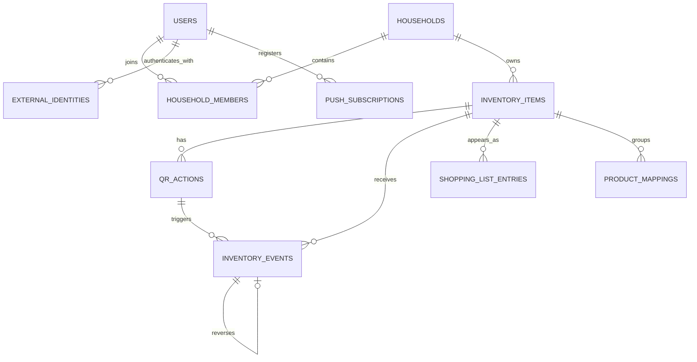

# Database Design

## 1. Purpose

This document describes the initial SQLite database model.

The design separates:

* users and authentication
* households
* generic inventory items
* reusable QR actions
* individual scan events
* immutable inventory events
* shopping-list state
* concrete retail products
* purchase and price history

The database schema will be managed using versioned SQL migrations.

---

## 2. General Conventions

### Primary keys

Application entities use integer primary keys where practical.

Externally visible events use UUID strings.

### Timestamps

Timestamps are stored as UTC text using RFC 3339 formatting:

```text
2026-07-13T18:42:19.312Z
```

### Boolean values

SQLite stores Boolean fields as integers:

```text
0 = false
1 = true
```

Boolean columns should include a constraint:

```sql
CHECK (enabled IN (0, 1))
```

### Quantities

The first version uses integer quantities.

Examples:

```text
2 packages of butter
6 bottles of water
3 rolls of paper towels
```

Supporting fractional quantities can be added later using scaled integers, such as grams or millilitres.

### Foreign keys

Foreign-key enforcement must be enabled for every SQLite connection:

```sql
PRAGMA foreign_keys = ON;
```

---

## 3. Entity Overview



---

## 4. Users

The `users` table represents an application user independently of the login method.

```sql
CREATE TABLE users (
    id INTEGER PRIMARY KEY AUTOINCREMENT,
    display_name TEXT NOT NULL,
    email TEXT,
    created_at TEXT NOT NULL,
    updated_at TEXT NOT NULL
);
```

The email is not necessarily unique because:

* Apple may provide a private relay email
* a user could link multiple providers
* identity should use the provider's stable subject identifier

A later account-linking implementation may add a normalized unique email policy.

---

## 5. External Identities

External identities connect application users to Google, Apple, or another OpenID Connect provider.

```sql
CREATE TABLE external_identities (
    id INTEGER PRIMARY KEY AUTOINCREMENT,
    user_id INTEGER NOT NULL,
    provider TEXT NOT NULL,
    provider_subject TEXT NOT NULL,
    email TEXT,
    created_at TEXT NOT NULL,

    FOREIGN KEY (user_id)
        REFERENCES users(id)
        ON DELETE CASCADE,

    UNIQUE (provider, provider_subject)
);
```

Examples:

```text
provider = google
provider_subject = Google's stable sub claim
```

```text
provider = apple
provider_subject = Apple's stable user identifier
```

Email must not be used as the provider identity.

---

## 6. Password Credentials

If local password login is supported, password credentials should be kept separate from the main user table.

```sql
CREATE TABLE password_credentials (
    user_id INTEGER PRIMARY KEY,
    password_hash TEXT NOT NULL,
    updated_at TEXT NOT NULL,

    FOREIGN KEY (user_id)
        REFERENCES users(id)
        ON DELETE CASCADE
);
```

Passwords must be hashed using Argon2id with a unique salt.

Plain-text passwords must never be stored.

---

## 7. Households

A household is the ownership boundary for inventory and shopping-list data.

```sql
CREATE TABLE households (
    id INTEGER PRIMARY KEY AUTOINCREMENT,
    name TEXT NOT NULL,
    created_at TEXT NOT NULL,
    updated_at TEXT NOT NULL
);
```

Even if the first version supports only one household, modelling it explicitly avoids difficult schema changes later.

---

## 8. Household Members

```sql
CREATE TABLE household_members (
    household_id INTEGER NOT NULL,
    user_id INTEGER NOT NULL,
    role TEXT NOT NULL,
    joined_at TEXT NOT NULL,

    PRIMARY KEY (household_id, user_id),

    FOREIGN KEY (household_id)
        REFERENCES households(id)
        ON DELETE CASCADE,

    FOREIGN KEY (user_id)
        REFERENCES users(id)
        ON DELETE CASCADE,

    CHECK (role IN ('owner', 'member'))
);
```

Possible future roles:

```text
owner
member
viewer
```

For version 1, `owner` and `member` are sufficient.

---

## 9. Sessions

Persistent browser sessions can be managed by the selected Rust session library.

A conceptual session table is:

```sql
CREATE TABLE sessions (
    id TEXT PRIMARY KEY,
    data BLOB NOT NULL,
    expires_at INTEGER NOT NULL
);
```

The exact format may be created and managed by `tower-sessions` or its chosen SQLite store.

Session records should be periodically deleted after expiration.

---

## 10. Inventory Categories

Categories help organize both the inventory and shopping list.

```sql
CREATE TABLE inventory_categories (
    id INTEGER PRIMARY KEY AUTOINCREMENT,
    household_id INTEGER NOT NULL,
    name TEXT NOT NULL,
    sort_order INTEGER NOT NULL DEFAULT 0,
    created_at TEXT NOT NULL,

    FOREIGN KEY (household_id)
        REFERENCES households(id)
        ON DELETE CASCADE,

    UNIQUE (household_id, name)
);
```

Examples:

```text
Dairy
Drinks
Frozen
Cleaning
Bathroom
Pantry
```

---

## 11. Inventory Items

An inventory item represents a generic household concept.

Examples:

```text
Butter
Milk
Toilet paper
Dishwasher tablets
```

It does not represent a specific brand.

```sql
CREATE TABLE inventory_items (
    id INTEGER PRIMARY KEY AUTOINCREMENT,
    household_id INTEGER NOT NULL,
    category_id INTEGER,
    name TEXT NOT NULL,
    unit TEXT NOT NULL,
    current_quantity INTEGER NOT NULL DEFAULT 0,
    shopping_threshold INTEGER NOT NULL DEFAULT 0,
    default_restock_quantity INTEGER NOT NULL DEFAULT 1,
    notes TEXT,
    active INTEGER NOT NULL DEFAULT 1,
    created_at TEXT NOT NULL,
    updated_at TEXT NOT NULL,

    FOREIGN KEY (household_id)
        REFERENCES households(id)
        ON DELETE CASCADE,

    FOREIGN KEY (category_id)
        REFERENCES inventory_categories(id)
        ON DELETE SET NULL,

    CHECK (current_quantity >= 0),
    CHECK (shopping_threshold >= 0),
    CHECK (default_restock_quantity > 0),
    CHECK (active IN (0, 1)),

    UNIQUE (household_id, name)
);
```

Example:

```text
name: Butter
unit: package
current_quantity: 2
shopping_threshold: 1
default_restock_quantity: 2
```

When the quantity reaches 1 or lower, Butter belongs on the shopping list.

---

## 12. QR Actions

A QR action is reusable.

Each inventory item will normally have at least:

* one decrease action
* one increase action

```sql
CREATE TABLE qr_actions (
    id INTEGER PRIMARY KEY AUTOINCREMENT,
    household_id INTEGER NOT NULL,
    inventory_item_id INTEGER NOT NULL,
    token TEXT NOT NULL,
    quantity_change INTEGER NOT NULL,
    enabled INTEGER NOT NULL DEFAULT 1,
    created_at TEXT NOT NULL,
    updated_at TEXT NOT NULL,

    FOREIGN KEY (household_id)
        REFERENCES households(id)
        ON DELETE CASCADE,

    FOREIGN KEY (inventory_item_id)
        REFERENCES inventory_items(id)
        ON DELETE CASCADE,

    CHECK (quantity_change <> 0),
    CHECK (enabled IN (0, 1)),

    UNIQUE (token)
);
```

Example rows:

```text
Butter decrease:
    quantity_change = -1

Butter increase:
    quantity_change = +1
```

Tokens should contain sufficient randomness and must not expose the inventory item ID.

---

## 13. Processed Scan Requests

This table provides idempotency.

Each real scan receives a unique event identifier. Retrying one scan uses the same identifier.

```sql
CREATE TABLE processed_scan_requests (
    scan_id TEXT PRIMARY KEY,
    household_id INTEGER NOT NULL,
    source TEXT NOT NULL,
    source_identifier TEXT,
    raw_code TEXT,
    inventory_event_id TEXT,
    received_at TEXT NOT NULL,
    processed_at TEXT,
    result_status TEXT NOT NULL,
    result_body TEXT,

    FOREIGN KEY (household_id)
        REFERENCES households(id)
        ON DELETE CASCADE,

    FOREIGN KEY (inventory_event_id)
        REFERENCES inventory_events(id),

    CHECK (
        source IN (
            'usb_scanner',
            'pwa_scanner',
            'public_qr_page',
            'manual'
        )
    ),

    CHECK (
        result_status IN (
            'processing',
            'succeeded',
            'rejected'
        )
    )
);
```

The scanner ID can be stored in `source_identifier`.

For a browser action, it may contain the user ID or a device identifier.

A repeated request with the same `scan_id` returns the previously stored result.

---

## 14. Inventory Events

Inventory events form the immutable audit history.

```sql
CREATE TABLE inventory_events (
    id TEXT PRIMARY KEY,
    household_id INTEGER NOT NULL,
    inventory_item_id INTEGER NOT NULL,
    quantity_change INTEGER NOT NULL,
    quantity_before INTEGER NOT NULL,
    quantity_after INTEGER NOT NULL,
    source TEXT NOT NULL,
    source_identifier TEXT,
    qr_action_id INTEGER,
    user_id INTEGER,
    reversed_event_id TEXT,
    created_at TEXT NOT NULL,

    FOREIGN KEY (household_id)
        REFERENCES households(id)
        ON DELETE CASCADE,

    FOREIGN KEY (inventory_item_id)
        REFERENCES inventory_items(id),

    FOREIGN KEY (qr_action_id)
        REFERENCES qr_actions(id)
        ON DELETE SET NULL,

    FOREIGN KEY (user_id)
        REFERENCES users(id)
        ON DELETE SET NULL,

    FOREIGN KEY (reversed_event_id)
        REFERENCES inventory_events(id),

    CHECK (quantity_change <> 0),
    CHECK (quantity_before >= 0),
    CHECK (quantity_after >= 0),

    UNIQUE (reversed_event_id)
);
```

`reversed_event_id` is set on the compensating event.

Example:

```text
Original event A:
    quantity_change = -1
    reversed_event_id = NULL

Undo event B:
    quantity_change = +1
    reversed_event_id = A
```

The unique constraint prevents the same event from being reversed twice.

---

## 15. Shopping-List Entries

Shopping-list entries preserve history instead of being immediately deleted.

```sql
CREATE TABLE shopping_list_entries (
    id INTEGER PRIMARY KEY AUTOINCREMENT,
    household_id INTEGER NOT NULL,
    inventory_item_id INTEGER NOT NULL,
    requested_quantity INTEGER NOT NULL DEFAULT 1,
    source TEXT NOT NULL,
    created_at TEXT NOT NULL,
    completed_at TEXT,
    completed_by INTEGER,

    FOREIGN KEY (household_id)
        REFERENCES households(id)
        ON DELETE CASCADE,

    FOREIGN KEY (inventory_item_id)
        REFERENCES inventory_items(id),

    FOREIGN KEY (completed_by)
        REFERENCES users(id)
        ON DELETE SET NULL,

    CHECK (requested_quantity > 0),

    CHECK (
        source IN (
            'threshold',
            'manual'
        )
    )
);
```

Only one active shopping-list entry should exist per item.

```sql
CREATE UNIQUE INDEX unique_active_shopping_entry
ON shopping_list_entries (household_id, inventory_item_id)
WHERE completed_at IS NULL;
```

This prevents repeated decrease scans from creating duplicate shopping-list rows.

---

## 16. Product Barcode Mappings

A product mapping connects a concrete retail barcode to a generic inventory item.

```sql
CREATE TABLE product_barcode_mappings (
    barcode TEXT PRIMARY KEY,
    household_id INTEGER NOT NULL,
    inventory_item_id INTEGER NOT NULL,
    product_name TEXT,
    brand TEXT,
    package_quantity TEXT,
    image_url TEXT,
    data_source TEXT,
    created_at TEXT NOT NULL,
    updated_at TEXT NOT NULL,

    FOREIGN KEY (household_id)
        REFERENCES households(id)
        ON DELETE CASCADE,

    FOREIGN KEY (inventory_item_id)
        REFERENCES inventory_items(id)
        ON DELETE CASCADE
);
```

Example:

```text
Barcode 1:
    Kerrygold Butter 250 g
    → Butter

Barcode 2:
    Supermarket Own-Brand Butter 250 g
    → Butter
```

The barcode does not determine the inventory item automatically unless the mapping already exists.

---

## 17. Purchase Records

A purchase records the act of buying an inventory item.

```sql
CREATE TABLE purchases (
    id INTEGER PRIMARY KEY AUTOINCREMENT,
    household_id INTEGER NOT NULL,
    inventory_item_id INTEGER NOT NULL,
    barcode TEXT,
    quantity INTEGER NOT NULL,
    store_name TEXT,
    price_cents INTEGER,
    currency TEXT,
    purchased_by INTEGER,
    purchased_at TEXT NOT NULL,

    FOREIGN KEY (household_id)
        REFERENCES households(id)
        ON DELETE CASCADE,

    FOREIGN KEY (inventory_item_id)
        REFERENCES inventory_items(id),

    FOREIGN KEY (barcode)
        REFERENCES product_barcode_mappings(barcode)
        ON DELETE SET NULL,

    FOREIGN KEY (purchased_by)
        REFERENCES users(id)
        ON DELETE SET NULL,

    CHECK (quantity > 0),
    CHECK (price_cents IS NULL OR price_cents >= 0)
);
```

The price refers to the complete purchase record.

For example:

```text
2 packages of butter
total price: €4.38
```

A later version may store per-unit price separately.

---

## 18. Push Subscriptions

One user may have several registered devices.

```sql
CREATE TABLE push_subscriptions (
    id INTEGER PRIMARY KEY AUTOINCREMENT,
    user_id INTEGER NOT NULL,
    endpoint TEXT NOT NULL,
    p256dh_key TEXT NOT NULL,
    auth_key TEXT NOT NULL,
    user_agent TEXT,
    created_at TEXT NOT NULL,
    last_used_at TEXT,

    FOREIGN KEY (user_id)
        REFERENCES users(id)
        ON DELETE CASCADE,

    UNIQUE (endpoint)
);
```

Expired or invalid subscriptions should be deleted when a push service reports that they are no longer valid.

---

## 19. Scanner Devices

Known physical scanners can be registered.

```sql
CREATE TABLE scanner_devices (
    id TEXT PRIMARY KEY,
    household_id INTEGER NOT NULL,
    name TEXT NOT NULL,
    enabled INTEGER NOT NULL DEFAULT 1,
    last_seen_at TEXT,
    created_at TEXT NOT NULL,

    FOREIGN KEY (household_id)
        REFERENCES households(id)
        ON DELETE CASCADE,

    CHECK (enabled IN (0, 1))
);
```

Example:

```text
id: kitchen-scanner
name: Kitchen QR Scanner
```

The internal endpoint validates that the scanner is enabled before processing scans.

---

## 20. Inventory Update Transaction

The following operations must happen inside one transaction:

1. Reserve the `scan_id`.
2. Resolve the QR action.
3. Read the current item quantity.
4. Calculate the new quantity.
5. Update the inventory item.
6. Insert an inventory event.
7. Create or complete the shopping-list entry.
8. Store the response for idempotent retries.
9. Commit.

Conceptual SQL:

```sql
BEGIN IMMEDIATE;

INSERT INTO processed_scan_requests (
    scan_id,
    household_id,
    source,
    source_identifier,
    raw_code,
    received_at,
    result_status
)
VALUES (?, ?, ?, ?, ?, ?, 'processing');

SELECT
    inventory_item_id,
    quantity_change
FROM qr_actions
WHERE token = ?
  AND enabled = 1;

SELECT
    current_quantity,
    shopping_threshold
FROM inventory_items
WHERE id = ?;

UPDATE inventory_items
SET
    current_quantity = ?,
    updated_at = ?
WHERE id = ?;

INSERT INTO inventory_events (...);

-- Add or complete shopping-list entry.

UPDATE processed_scan_requests
SET
    inventory_event_id = ?,
    processed_at = ?,
    result_status = 'succeeded',
    result_body = ?
WHERE scan_id = ?;

COMMIT;
```

`BEGIN IMMEDIATE` acquires the SQLite write lock before the quantity is read. This prevents another writer from reading the same quantity and overwriting the result.

---

## 21. Quantity Floor

Version 1 does not allow negative inventory.

A decrease at quantity zero produces no inventory event and returns a rejected result:

```text
Item is already at zero.
```

This is preferable to silently creating an event whose effective quantity change is zero.

The scanner can signal this with a different feedback tone.

---

## 22. Shopping-List Rules

After an inventory update:

```text
If current_quantity <= shopping_threshold:
    ensure an active shopping-list entry exists

If current_quantity > shopping_threshold:
    complete an active threshold-generated entry
```

Manual shopping-list entries require a policy decision.

Recommended version 1 rule:

* threshold-generated entries may be completed automatically
* manually created entries remain until a user completes them

This prevents an automatic restock from unexpectedly removing a deliberate manual reminder.

---

## 23. Indexes

Useful initial indexes include:

```sql
CREATE INDEX inventory_items_by_household
ON inventory_items (household_id, active);

CREATE INDEX inventory_events_by_item
ON inventory_events (inventory_item_id, created_at DESC);

CREATE INDEX inventory_events_by_household
ON inventory_events (household_id, created_at DESC);

CREATE INDEX shopping_entries_by_household
ON shopping_list_entries (household_id, completed_at);

CREATE INDEX purchases_by_item
ON purchases (inventory_item_id, purchased_at DESC);

CREATE INDEX external_identities_by_user
ON external_identities (user_id);
```

Indexes should be added based on actual query patterns. Avoid adding indexes to every column automatically because each index increases write cost.

---

## 24. Migration Structure

Suggested migration files:

```text
backend/migrations/
├── 0001_users.sql
├── 0002_households.sql
├── 0003_inventory.sql
├── 0004_qr_actions.sql
├── 0005_inventory_events.sql
├── 0006_shopping_list.sql
├── 0007_products_and_purchases.sql
├── 0008_push_subscriptions.sql
└── 0009_scanner_devices.sql
```

Migrations must be committed to Git.

The production database file must not be committed.

---

## 25. Backup Strategy

At minimum, create one automated daily backup.

Recommended retention:

```text
7 daily backups
4 weekly backups
3 monthly backups
```

The backup should include:

* SQLite database
* configuration without secrets
* generated application data that cannot be recreated

QR images do not need to be backed up if they can be regenerated from the QR action records.

Secrets should be backed up separately using an encrypted method.
